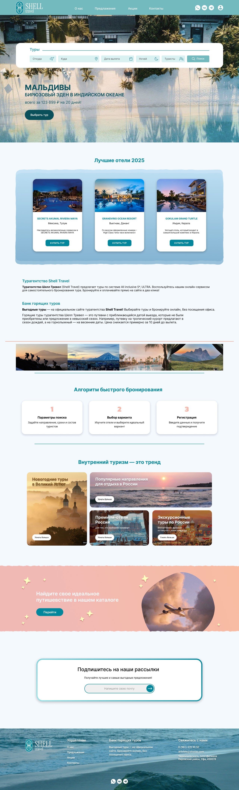

# README — English / Русский

This file is available in two languages: English and Russian.  
Данный файл доступен на двух языках: английском и русском.

---

## 🇬🇧 English

# Shell Travel — Tour Agency Website

## Description
A full-featured travel agency landing page with a working navigation menu, interactive search form, hotel cards, and a multi-section layout designed to showcase tours and attract customers.

The site includes demo functionality: most buttons lead to a temporary page, and the search/booking forms are front-end only (they close without sending data).

## Technologies Used
- HTML5
- CSS3 (Flexbox, Grid)
- JavaScript (vanilla, no libraries)

## Features

### Navigation & Header
- Fully working menu with smooth scrolling
- Logo linking to "About" section (both in header and footer)
- Social media icons (WhatsApp, VK, Telegram) — non-functional (demo)
- User icon opening a login/registration pop-up (forms close on submit, no backend)

### Search Form
- Search tours by: departure city, destination, date, nights, number of travelers
- "Search" button clears the form (demo-only, no data sent)

### Promo Section
- 6 promo banners with special offers
- Each banner has a "Choose Tour" button → redirects to a temporary page

### Hotel Showcase
- "Best Hotels 2026" section with 3 hotel cards
- Each card includes hotel info and a "Buy Tour" button (redirects to temporary page)

### About & Booking Guide
- "About Company" section
- "Fast Booking Algorithm" — 3-step guide explaining how to book a tour

### Tour Catalog
- "Domestic Tourism is a Trend" — 4 tour cards with "Learn More" buttons
- "Find Your Perfect Journey" — link to catalog

### Newsletter Subscription
- Email subscription form with arrow button (demo-only, no backend)

### Footer
- Navigation menu
- Promotional slogan
- Contact information
- Logo linking to "About" section
- **Animated beach GIF as background** — adds a dynamic, summery vibe

## Future Improvements
- Connect booking forms to a backend (Node.js)
- Add real email newsletter integration
- Implement actual search functionality with database
- Make social media icons and login system functional

## Screenshot

---

## 🇷🇺 Русский

# Shell Travel — Сайт туристического агентства

## Описание
Полноценная посадочная страница туристического агентства с работающим меню, интерактивной формой поиска, карточками отелей и множеством секций, созданных для показа туров и привлечения клиентов.

Сайт включает демо-функциональность: большинство кнопок ведут на временную страницу, а формы поиска и бронирования работают только на фронтенде (закрываются без отправки данных).

## Используемые технологии
- HTML5
- CSS3 (Flexbox, Grid)
- JavaScript (чистый, без библиотек)

## Функциональность

### Навигация и шапка
- Полностью работающее меню с плавной прокруткой
- Логотип, ведущий в раздел «О компании» (в шапке и подвале)
- Иконки соцсетей (WhatsApp, VK, Telegram) — не работают (демо)
- Иконка пользователя, открывающая окно входа/регистрации (формы закрываются, данные не уходят)

### Форма поиска
- Поиск туров по: городу вылета, направлению, дате, ночам, количеству туристов
- Кнопка «Поиск» очищает форму (демо, данные не отправляются)

### Промо-блок
- 6 баннеров со специальными предложениями
- У каждого баннера кнопка «Выбрать тур» → ведёт на временную страницу

### Отели
- Раздел «Лучшие отели 2026» с 3 карточками отелей
- Каждая карточка содержит информацию об отеле и кнопку «Купить тур» (ведёт на временную страницу)

### О компании и бронирование
- Раздел «О компании»
- «Алгоритм быстрого бронирования» — инструкция из 3 шагов

### Каталог туров
- «Внутренний туризм — это тренд» — 4 карточки туров с кнопками «Узнать больше»
- «Найдите своё идеальное путешествие» — ссылка на каталог

### Подписка на рассылку
- Форма подписки с кнопкой-стрелкой (демо, без бэкенда)

### Подвал
- Меню навигации
- Рекламный слоган
- Контактная информация
- Логотип, ведущий в раздел «О компании»
- **Анимированная GIF-картинка с пляжем на фоне** — добавляет динамичное летнее настроение

## Планы по доработке
- Подключить формы бронирования к бэкенду (Node.js)
- Добавить реальную отправку писем для рассылки
- Реализовать поиск через базу данных
- Сделать рабочие соцсети и систему входа в личный кабинет

## Скриншот

